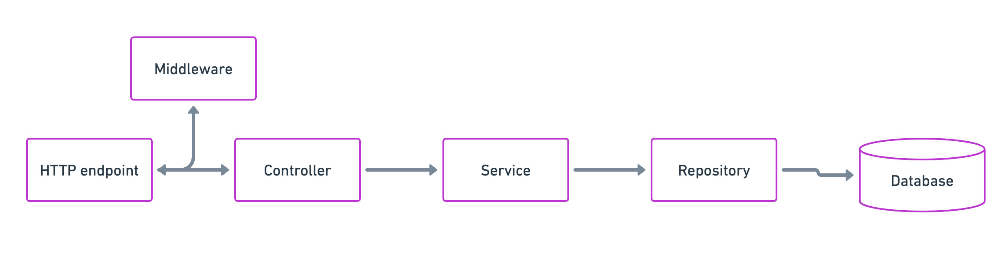
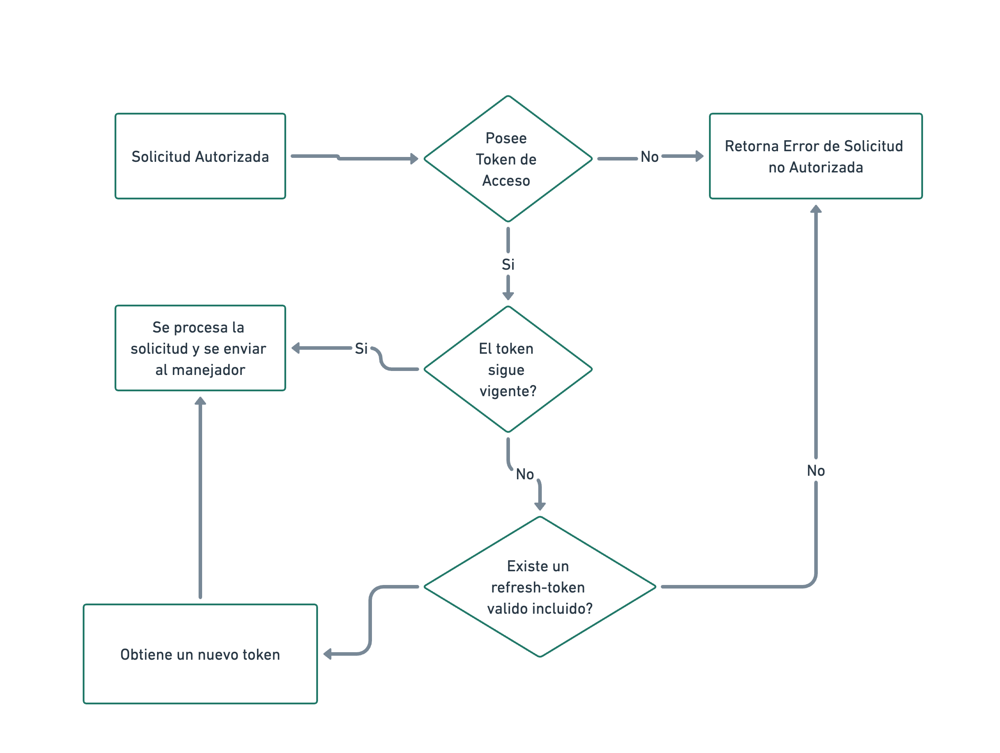

# Proyecto Backend Node.js

Este es un proyecto backend desarrollado con TypeScript y gestionado con Yarn 

## Descripción del proyecto

Este proyecto es un backend desarrollado en Node.js que utiliza diversas tecnologías y herramientas para crear una aplicación web. Proporciona una estructura organizada y modularizada para el desarrollo de la aplicación, con controladores, modelos, rutas, middlewares y utilidades. Utiliza TypeScript como lenguaje de programación y ExpressJS como framework web. También se integra con MongoDB para el almacenamiento de datos, Redis para la gestión de tokens de acceso y actualización, y otras bibliotecas como Bcrypt, Morgan, Lodash y Zod.

El proyecto incluye un diagrama de flujo de datos que muestra cómo se mueven los datos dentro de la aplicación, así como un diagrama que ilustra el flujo de los tokens de acceso y actualización.

Si deseas contribuir al proyecto, puedes seguir los pasos mencionados en la sección de contribución. También puedes contactarnos si tienes alguna pregunta o sugerencia.

¡Gracias por tu interés en este proyecto!

## Índice

01. [Requisitos](#requisitos)
02. [Instalación](#instalación)
03. [Estructura del proyecto](#estructura-del-proyecto)
04. [Tecnologías](#tecnologías)
05. [Data flow](#data-flow)
06. [Access & Refresh Token](#access--refresh-token)
07. [Contribución](#contribución)
08. [Contacto](#contacto)

## Requisitos

*   Node.js
*   Yarn

## Instalación

01. Clona este repositorio.
02. Ejecuta `yarn install` para instalar las dependencias.
03. Ejecuta `yarn start` para iniciar el servidor.

## Estructura del proyecto

*   `src/`: Contiene el código fuente del proyecto.

    -   `controllers/`: Contiene los controladores de la aplicación.
    -   `models/`: Contiene los modelos de datos de la aplicación.
    -   `routes/`: Contiene las rutas de la aplicación.
    -   `middlewares/`: Contiene los middlewares de la aplicación.
    -   `utils/`: Contiene utilidades y funciones auxiliares.

*   `dist/`: Contiene los archivos compilados.
*   `node_modules/`: Contiene las dependencias del proyecto.
*   `package.json`: Archivo de configuración de Yarn.
*   `tsconfig.json`: Archivo de configuración de TypeScript.
*   `config/`: Contiene los archivos de configuracion del proyecto

## Tecnologias

01. TypeScript
02. Node.js
03. Yarn
04. MongoDB NodeJS Drive
05. ExpressJS
06. Bcrypt
07. Morgan
08. Lodash
09. Zod
10. Redis

## Data flow

## Access & Refresh Token

## Contribución

## LINK del proyecto alojado en render

https://nodejs-ts-prueba-tecnica.onrender.com

## Video de explicación
[Ver video de explicación](https://youtu.be/w75-5qVkoOI)

### Si deseas contribuir a este proyecto, sigue los siguientes pasos:

01. Haz un fork de este repositorio.
02. Crea una rama con tu nueva funcionalidad: `git checkout -b nueva-funcionalidad`.
03. Realiza los cambios necesarios y realiza los commits: `git commit -m "Agrega nueva funcionalidad"`.
04. Sube los cambios a tu repositorio: `git push origin nueva-funcionalidad`.
05. Abre un pull request en este repositorio.

## Contacto

Si tienes alguna pregunta o sugerencia, no dudes en contactarnos:

* Email: dragoncelesty@gmail.com
* Teléfono: (505) 8828 2644
* Sitio web: https://dragoncelesty.github.io/portafolio/

<!-- Fin del documento -->
