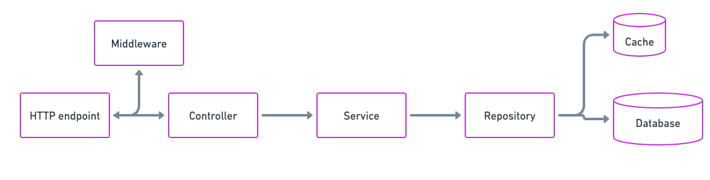

# Proyecto Backend Node.js

Este es un proyecto backend desarrollado con TypeScript y gestionado con Yarn.

## Índice

1. [Requisitos](#requisitos)
2. [Instalación](#instalación)
3. [Estructura del proyecto](#estructura-del-proyecto)
4. [Tecnologías](#tecnologías)
5. [Data flow](#data-flow)
6. [Access & Refresh Token](#access--refresh-token)
7. [Contribución](#contribución)
8. [Contacto](#contacto)

## Requisitos

*   Node.js
*   Yarn

## Instalación

01. Clona este repositorio.
02. Ejecuta `yarn install` para instalar las dependencias.
03. Ejecuta `yarn start` para iniciar el servidor.

## Estructura del proyecto

*   `src/`: Contiene el código fuente del proyecto.

    -   `controllers/`: Contiene los controladores de la aplicación.
    -   `models/`: Contiene los modelos de datos de la aplicación.
    -   `routes/`: Contiene las rutas de la aplicación.
    -   `middlewares/`: Contiene los middlewares de la aplicación.
    -   `utils/`: Contiene utilidades y funciones auxiliares.

*   `dist/`: Contiene los archivos compilados.
*   `node_modules/`: Contiene las dependencias del proyecto.
*   `package.json`: Archivo de configuración de Yarn.
*   `tsconfig.json`: Archivo de configuración de TypeScript.
*   `config/`: Contiene los archivos de configuracion del proyecto

## Tecnologias

01. TypeScript
02. Node.js
03. Yarn
04. MongoDB NodeJS Drive
05. ExpressJS
06. Bcrypt
07. Morgan
08. Lodash
09. Zod
10. Redis

## Data flow

## Access & Refresh Token

## Contribución

Si deseas contribuir a este proyecto, sigue los siguientes pasos:

1. Haz un fork de este repositorio.
2. Crea una rama con tu nueva funcionalidad: `git checkout -b nueva-funcionalidad`.
3. Realiza los cambios necesarios y realiza los commits: `git commit -m "Agrega nueva funcionalidad"`.
4. Sube los cambios a tu repositorio: `git push origin nueva-funcionalidad`.
5. Abre un pull request en este repositorio.

## Contacto

Si tienes alguna pregunta o sugerencia, no dudes en contactarnos:

* Email: dragoncelesty@gmail.com
* Teléfono: (505) 8828 2644
* Sitio web: https://dragoncelesty.github.io/portafolio/

<!-- Fin del documento -->